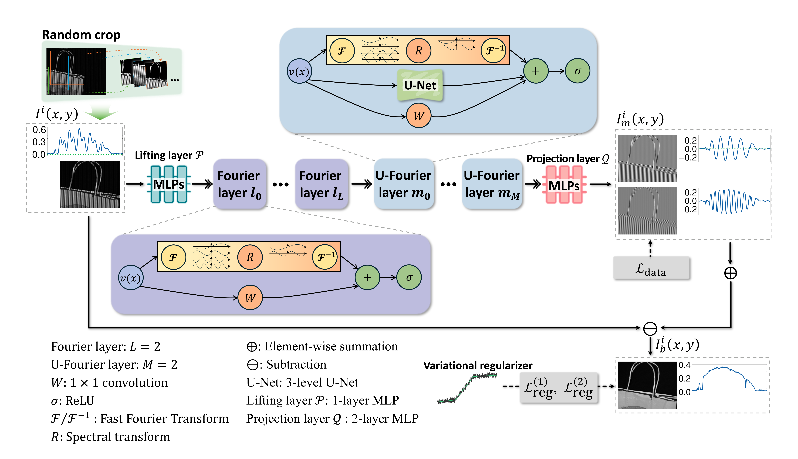

# U-FNO-FPP

This is the code repository for Single-shot fringe projection profilometry with a TGV-regularized U-Net enhanced Fourier Neural Operator.

## Data Availability

The source code used in this study is openly available in this repository at https://github.com/sjjlk/U-FNO-FPP. The experimental data are available from the corresponding author on reasonable request.
